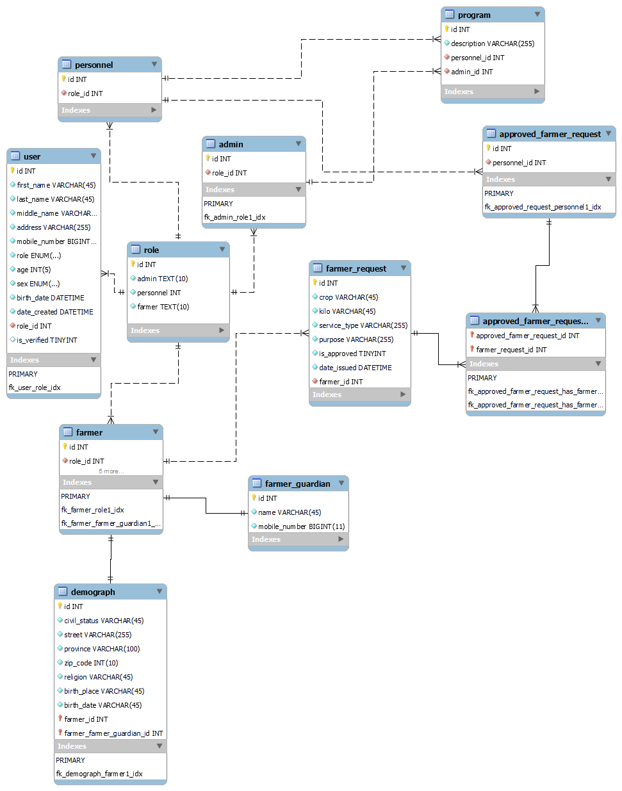

# Agrilcutre Management System

✔ School Project: A web application that allows an admin to manage agricultural things. This will be built using NodeJS, ReactJS, and MySQL.

## SQL Schema

## Team

[Edward](https://github.com/wardvisual)  
[France](https://github.com/france-stack007)
